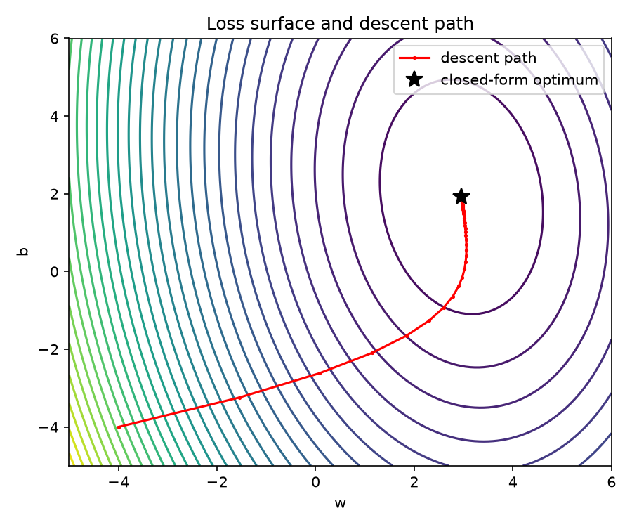

# Gradient Descent from Scratch

Linear regression trained with batch gradient descent, using only NumPy. No ML libraries: the gradients are derived by hand, verified numerically, and the result is checked against the exact least-squares solution.



## The math

Model: `y_hat = w*x + b`

Loss (mean squared error):

    L(w, b) = (1/n) * sum_i (w*x_i + b - y_i)^2

Let `e_i = w*x_i + b - y_i`. By the chain rule:

    dL/dw = (2/n) * sum_i e_i * x_i
    dL/db = (2/n) * sum_i e_i

Update rule with learning rate `lr`:

    w <- w - lr * dL/dw
    b <- b - lr * dL/db

## Run it

```bash
python -m venv .venv
source .venv/bin/activate        # Windows: .venv\Scripts\activate
pip install -r requirements.txt

python src/run_demo.py           # prints results, saves plots to figures/
pytest                           # runs the tests
```

## What the tests check

- The analytic gradient matches a finite-difference estimate.
- Gradient descent converges to the closed-form least-squares solution.
- The loss decreases over training.

## Results

On synthetic data generated from `y = 3x + 2` plus noise, gradient descent recovers parameters matching the closed-form solution to within a small tolerance. See `figures/` for the fitted line, loss curve, and loss surface with the descent path.

## Ideas to extend

- Learning-rate experiments: too small, too large (divergence), just right.
- Stochastic and mini-batch gradient descent.
- Multiple features (vectorized with matrices) and feature scaling.
- Momentum and Adam, compared on the same loss surface.
